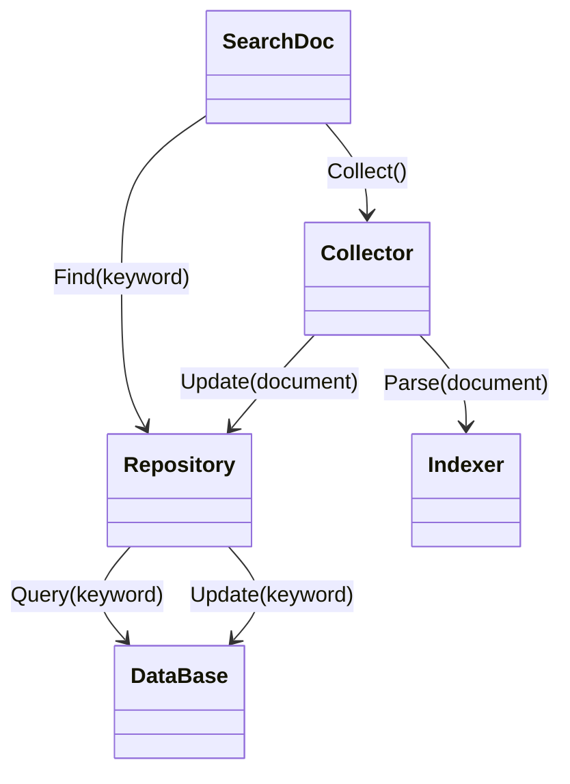

# Search Doc
[TOC]

## Badges

## Introduction
문서 파일의 내용을 찾아주는 검색 프로그램

컴퓨터 내에서 모든 문서 파일에서 검색어와 일치하는 내용을 포함한 문서를 찾아준다.

* 컴퓨터 내 전체 경로를 탐색
* 문서 파일의 단어마다 인덱싱이 된 DB
* 하나의 단어를 쿼리 할 수 있는 API
* 출력을 보여주는 뷰어



## TODO
[-] 특정 키워드를 포함하는 문서를 찾아주는 기능 추가 
[-] 데이터베이스에서 키워드를 통해 문서를 찾아주는 기능 추가
[-] 데이터베이스 연동

## Docker

```terminal
wsl

docker build -t math-cpp .
docker run -it --rm -v ${PWD}:/develop math-cpp
docker tag math-cpp leeh8911/math-cpp:latest
docker push leeh8911/math-cpp:latest
```

## Github

```terminal
ssh-keygen -t ed25519 -C "your@email.com"
eval "$(ssh-agent -s)"
ssh-add ~/.ssh/id_ed25519
cat /root/.ssh/id_25519.pub
```
